# Simulating Secure, Resilient Dual-ISP Connections for Enhanced Business Collaboration.

The project "Simulating Secure, Resilient Dual-ISP Connections for Enhanced Business  
Collaboration" focuses on simulating a comprehensive network architecture. It connects  
Company BlueTech. with Monsters, Inc and CyberBooks via two Internet Service Providers (ISPs) to ensure secure, resilient connectivity. The project involves a three-tier network architecture for BlueTech, including core, distribution, and access layers. For Monsters, Inc and CyberBooks, a collapsed core architecture is employed due to their smaller scale.

Key network technologies include VLANs for segmentation, redundancy protocols for failover, and VPNs for encrypted communications between different organizations. EVE-NG, a network simulation platform, is used to design, implement, and validate the network's topology and configurations. Docker containers will host web and email services, ensuring high service availability. The network is designed to be modular, scalable, and secure, catering to current and future business collaboration requirements.

# Network Topology

**Overview**
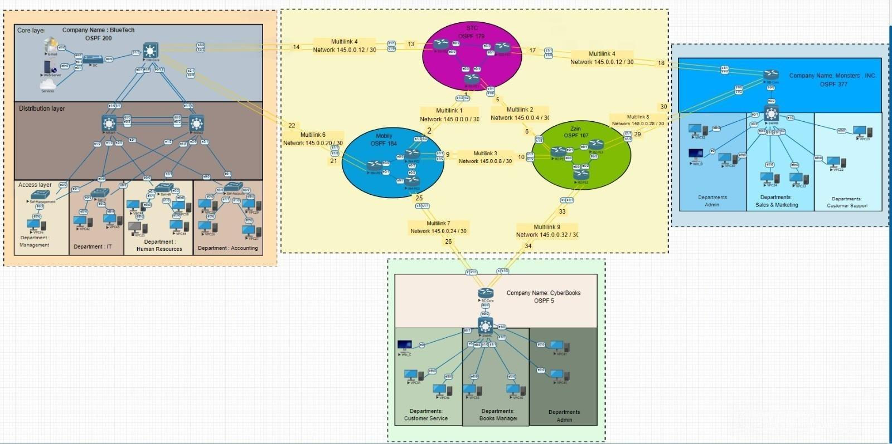

**BlueTech Company**
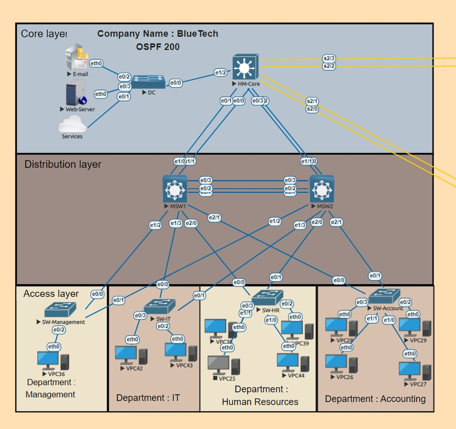

**Monsters INC**
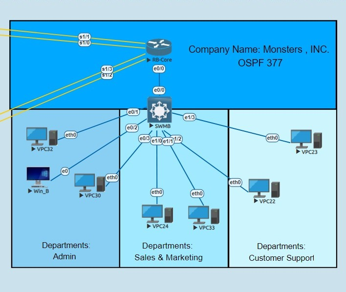

**CyberBooks Company**
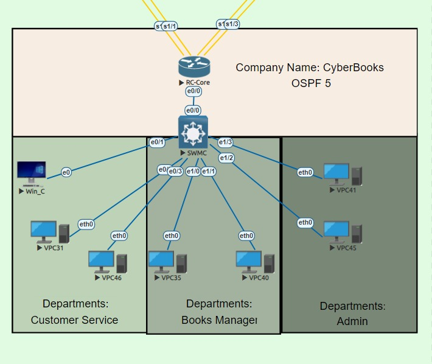

**ISPs**
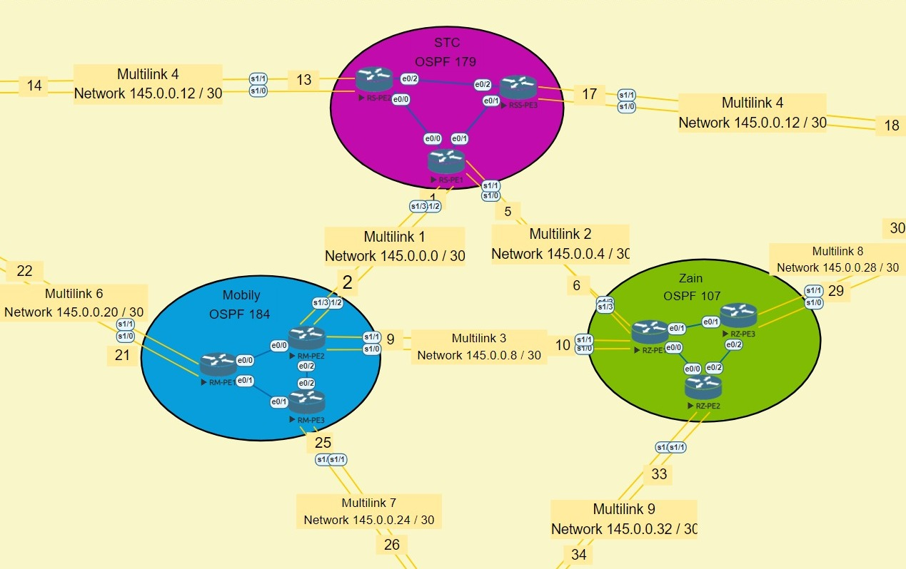

## Services Screenshots

### E-Mail Server

#### Set Up

You can read the configuration steps in Documentation file Page: 21.

#### Screenshots

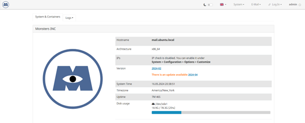 
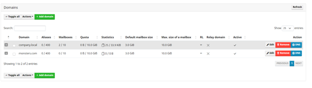 
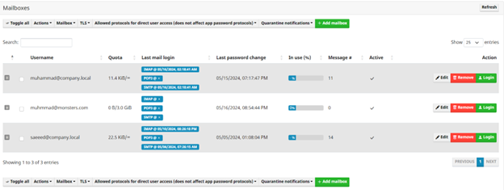
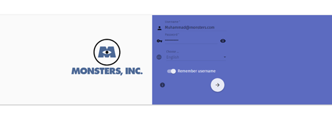 
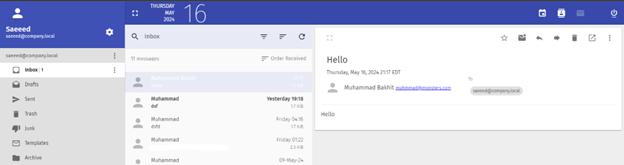

### Web Server

#### Set Up

You can read the configuration steps in Documentation file Page: 27.

#### Screenshots

 
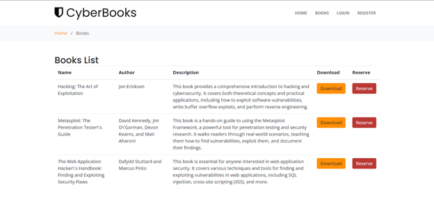 
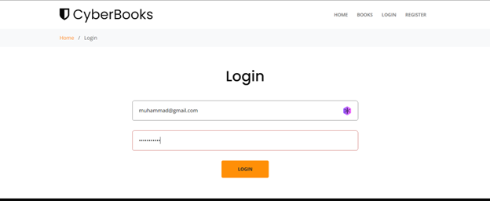
